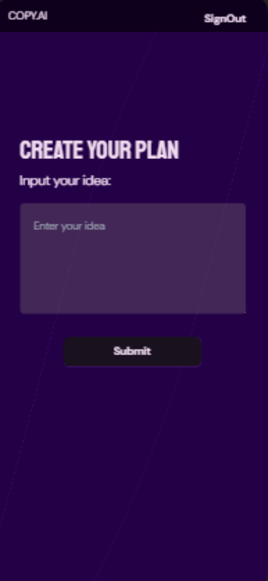

# CopyCraft Pro - Plataforma de Copywriting de Vanguardia con Inteligencia Artificial

| [English](README.md) | [Español](README.es.md) | 


1. [Desarrolladores](#desarrolladores)
2. [Tecnologías y Herramientas Destacadas](#tecnologías-y-herramientas-destacadas)
3. [Objetivo del Proyecto](#objetivo-del-proyecto)
4. [Documentación de Diseño UX/UI](#documentación-de-diseño-uxui)
   - [Concepto de Diseño](#concepto-de-diseño)
   - [Capturas de Pantalla](#capturas-de-pantalla)
5. [Funcionalidades Clave](#funcionalidades-clave)
   - [Briefing de Contenido](#briefing-de-contenido)
   - [Generación Automática de Copias](#generación-automática-de-copias)
   - [Variedad de Formatos](#variedad-de-formatos)
   - [Personalización](#personalización)
   - [Pruebas A/B](#pruebas-ab)
   - [Analíticas y Seguimiento de Rendimiento](#analíticas-y-seguimiento-de-rendimiento)
   - [Descarga de Archivos PDF](#descarga-de-archivos-pdf)
6. [Documentación de Arquitectura e Infraestructura](#documentación-de-arquitectura-e-infraestructura)
   - [Arquitectura de la Aplicación](#arquitectura-de-la-aplicación)
   - [Justificación Tecnológica](#justificación-tecnológica)
   - [Seguridad](#seguridad)
   - [Conclusión](#conclusión)
7. [Ejecución del Proyecto Localmente](#ejecución-del-proyecto-localmente)

## Desarrolladores
- Ezequiel Cabello - [GitHub](https://github.com/Kibbax) | [LinkedIn](https://www.linkedin.com/in/ezequielcabello/)
- Macarena Álvarez Castillo - [GitHub](https://github.com/MacaAC) | [LinkedIn](https://www.linkedin.com/in/maria-macarena-álvarez-castillo-56445a176/)
- Rodrigo Peralta Montero - [GitHub](https://github.com/Rodrigopm98) | [LinkedIn](https://www.linkedin.com/in/rodrigoperaltam/)

## Tecnologías y Herramientas Destacadas
- **Frontend:** Next.js, React 18, Tailwind CSS
- **Backend:** Node.js, Express, Prisma, PostgreSQL
- **Autenticación:** NextAuth
- **Diseño UX/UI:** Figma
- **Seguridad:** JWT, HTTPS, medidas contra ataques DDoS

## Objetivo del Proyecto
CopyCraft Pro tiene como objetivo simplificar y acelerar el proceso de creación de contenido para equipos de marketing, utilizando tecnologías avanzadas como la inteligencia artificial.

## Documentación de Diseño UX/UI

### Concepto de Diseño
CopyCraft Pro se enfoca en proporcionar a los profesionales del marketing una experiencia de usuario atractiva y efectiva. Con un diseño intuitivo y características optimizadas, la plataforma busca inspirar la creatividad y la eficiencia en la creación de contenido cautivador.

### Capturas de Pantalla

#### Página de Inicio


**Descripción:**
La página de inicio de CopyCraft Pro da la bienvenida a los usuarios con un diseño limpio y amigable, brindando un acceso rápido a las funciones clave. La interfaz intuitiva invita a los usuarios a comenzar su experiencia de creación de contenido de manera eficiente.

#### Página de Inicio de Sesión


**Implementación de Validación:**
Implementamos validaciones de entrada utilizando React Hook Form para un manejo de formularios sin problemas en el frontend. Además, se aplica una capa adicional de validación mediante Yup, mejorando la experiencia del usuario y asegurando la integridad de los datos.

#### Página de Registro


**Descripción:**
La página de registro de CopyCraft Pro ofrece un proceso sencillo para que los nuevos usuarios se unan a la plataforma. Con un diseño claro y atractivo, el formulario de registro garantiza un proceso de incorporación rápido y sencillo a las potentes herramientas de CopyCraft Pro.

#### Página de Entrada de Datos



**Descripción:**
La página de entrada de datos de CopyCraft Pro presenta una interfaz intuitiva para la entrada de datos. Los usuarios pueden proporcionar información clave y recibir resultados precisos y personalizados. El diseño optimizado facilita la creación de consultas y la generación de copias convincentes.

## Funcionalidades Clave

### Briefing de Contenido
Proporciona una descripción detallada del proyecto de marketing, objetivos, audiencia objetivo, voz de la marca y palabras clave.

### Generación Automática de Copias
Utiliza algoritmos avanzados basados en inteligencia artificial para generar automáticamente copias para materiales de marketing, como titulares, descripciones de productos y publicidad.

### Variedad de Formatos
Genera contenido adaptado a diferentes formatos y plataformas, como redes sociales, boletines de correo electrónico

, blogs y campañas publicitarias.

### Personalización
Permite a los usuarios editar y ajustar las copias generadas para que se alineen con la voz y el estilo único de la marca.

### Pruebas A/B
Facilita la ejecución de pruebas A/B con diferentes variaciones de copias para determinar cuál resuena mejor con la audiencia y tiene tasas de conversión más altas.

### Analíticas y Seguimiento de Rendimiento
Mide el rendimiento del contenido directamente en la aplicación, rastreando la participación, tasas de clics y métricas de conversión para optimizar las campañas de marketing.

### Descarga de Archivos PDF
Permite a los usuarios descargar la copia generada en formato PDF, brindando una forma conveniente de almacenar y compartir el contenido producido por la aplicación.

## Documentación de Arquitectura e Infraestructura

### Arquitectura de la Aplicación
- **Frontend:** React.js, Next.js, Tailwind CSS para una experiencia de usuario atractiva.
- **Backend:** Node.js con Express, Prisma y PostgreSQL como base de datos NoSQL escalable.

### Justificación Tecnológica
La elección de Next.js para el frontend se debe a su rendimiento optimizado y capacidades de representación en el servidor, mejorando la experiencia del usuario. React 18 proporciona la flexibilidad necesaria para construir interfaces interactivas y dinámicas.

En el backend, Node.js y Express ofrecen una base sólida para construir una aplicación eficiente y escalable. La decisión de utilizar Prisma y PostgreSQL como base de datos se debe a la necesidad de una solución robusta y escalable, que permita una gestión eficiente de datos.

NextAuth proporciona autenticación de usuario segura y fácil de implementar, mientras que Figma se utiliza para el diseño UX/UI, facilitando la creación de interfaces intuitivas y visualmente atractivas.

### Seguridad
Implementaremos las siguientes medidas de seguridad:
- Autenticación de usuario con tokens JWT en Auth0.
- Validación de datos de entrada para prevenir ataques de inyección SQL.
- Protección contra ataques de denegación de servicio (DDoS) mediante limitación de velocidad de solicitud.
- Seguridad de la comunicación a través de HTTPS.

Para garantizar la integridad de los datos, implementaremos un plan de recuperación de datos que incluirá:
- Sistema de eliminación lógica tanto para usuarios como para sus consultas, permitiendo a los usuarios recuperar sus datos hasta la fecha de vencimiento, después de la cual se eliminarán permanentemente.

### Conclusión
La arquitectura de tres niveles de la aplicación asegura un diseño escalable y seguro. La separación de responsabilidades entre el frontend, backend y la base de datos permite un desarrollo eficiente y un mantenimiento sencillo. Además, la capacidad de consultar una API de terceros y registrar historiales de solicitudes enriquece la funcionalidad de la aplicación.

## Ejecución del Proyecto Localmente

1. **Clonar el Repositorio:**
   ```bash
   git clone https://github.com/Kibbax/copy-ai.git
   ```

2. **Instalar Dependencias:**
   ```bash
   cd copycraft-pro
   npm install
   ```

3. **Configurar Variables de Entorno:**
   - Copiar el archivo `.env.example` y renombrarlo a `.env`.
   - Completar las variables de entorno necesarias.

4. **Iniciar la Aplicación:**
   ```bash
   npm run dev
   ```

5. **Acceder a la Aplicación:**
   - Abrir tu navegador y visitar [http://localhost:3000](http://localhost:3000).

---

¡Gracias por elegir CopyCraft Pro! Esperamos que disfrutes de una experiencia de usuario excepcional y productiva. Si tienes alguna pregunta o sugerencia, no dudes en ponerte en contacto con nuestro equipo de desarrollo. ¡Feliz escritura!


